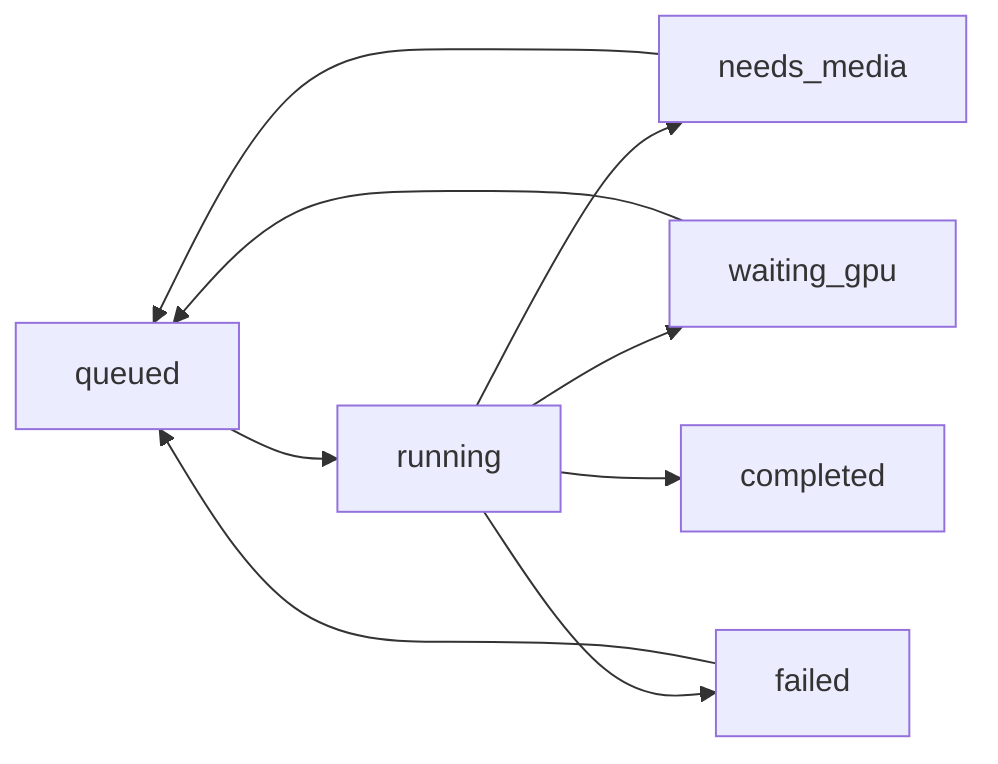

# Architecture et schéma de données — v0.1

## Arbitrages

- **Web :** FastAPI + Jinja2 + JS, une seule application pour aller rapidement jusqu'au parcours d'upload testé. Next.js/App Router pourront consommer les mêmes endpoints REST dans une version suivante. Aucun TypeScript/Prisma n'est prétendu implémenté.
- **Persistance :** SQLite via SQLAlchemy pour une seule instance locale ; à remplacer par PostgreSQL + Alembic quand l'hébergement commercial commencera. Pas de migration SQL pour l'instant (`create_all` est réservé à cette fondation).
- **Médias :** répertoire privé, contrôle propriétaire pour chaque lecture/écriture. Étape suivante : objet S3 et URLs signées courtes.
- **Traitement :** un processus worker distinct + transition atomique `queued -> running`. La stratégie de reprise est manuelle (`--recover`), pas une garantie de tolérance aux pannes multi-nœuds.
- **GPU :** opt-in explicite via variable d'environnement. Sans GPU configuré, le travail se termine à `waiting_gpu` sans fabriquer de résultat.

## Tables

| Table | Champs principaux | Règles |
| --- | --- | --- |
| `users` | `id`, `email`, `password_hash`, `created_at` | Email unique, Argon2 |
| `sessions` | `token_hash`, `user_id`, `csrf_token`, `expires_at` | Token aléatoire hashé, suppression à la déconnexion |
| `projects` | `id`, `owner_id`, `title`, `sector`, `description` | `sector ∈ {BNB, RESTO}` ; les opérations passent par le propriétaire |
| `assets` | `id`, `project_id`, `storage_key`, `kind`, `size_bytes`, `sha256` | Unicité du SHA-256 par projet, chemins gérés par le serveur |
| `jobs` | `id`, `project_id`, `status`, `stage`, `error`, `frame_count`, `artifact_key` | Historique en base ; pas de pourcentage fictif |

Relations : `User 1 → N Project`; `User 1 → N Session`; `Project 1 → N Asset`; `Project 1 → N Job`.

## Transitions de job

Les retours vers `queued` doivent être déclenchés via `/retry`; dans le cas `waiting_gpu`, ils nécessitent `YOMO_ENABLE_GPU=true`. `completed` désigne seulement l'existence d'un artefact `.ply` non vide, **pas** sa qualité visuelle ni sa capacité à être visionné dans YOMO v0.1.

## Menaces identifiées

- Photos/vidéos sensibles : pas de distribution publique par défaut, vérification de propriété au téléchargement, aucune indexation des médias. Le serveur doit être exposé uniquement derrière HTTPS, avec limites d'upload à l'entrée réseau.
- Sessions volées : cookies HttpOnly/SameSite et Secure en production ; révocation effective à la déconnexion. Un système commercial nécessitera aussi invalidation globale et rotation de session renforcée.
- Contenus malveillants : extension et MIME du client non fiables ; contrôle par Pillow/FFprobe, taille max ; avant mise en ligne, ajouter antivirus/sandbox, contrôle des ressources et limitation du nombre de fichiers.
- GPU hors budget : aucune tâche GPU n'est lancée par défaut. Futures protections : quotas, paiement préalable, monitoring, timeouts, réservation de ressources et quotas concurrentiels.
- Confidentialité : fichiers stockés localement ; sans politique de rétention et suppression garantie des sauvegardes, la solution ne doit pas être présentée comme conforme RGPD par défaut.
